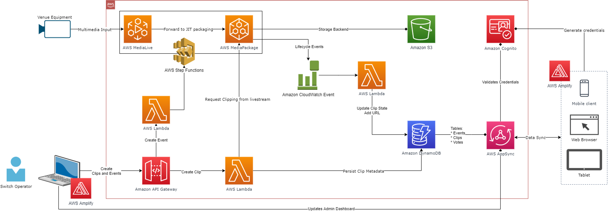

# Serverless Video Clipping

This repository contains an example architecture of a serverless, on-demand, video consumption and clipping generation using different AWS components on different areas.

On the event management side:
* Amazon API Gateway
* Amazon DynamoDB
* AWS Lambda
* Amazon Cognito

On the media transmission and clipping side:
* AWS Step Functions
* AWS Elemental MediaLive
* Amazon Simple Storage Service
* AWS Elemental MediaPackage

This application leverages [AWS Serverless Application Model (AWS SAM)](https://docs.aws.amazon.com/serverless-application-model/latest/developerguide/what-is-sam.html) to manage the necessary AWS resources, and uses [AWS Amplify](https://aws.amazon.com/amplify/) on the Frontend side